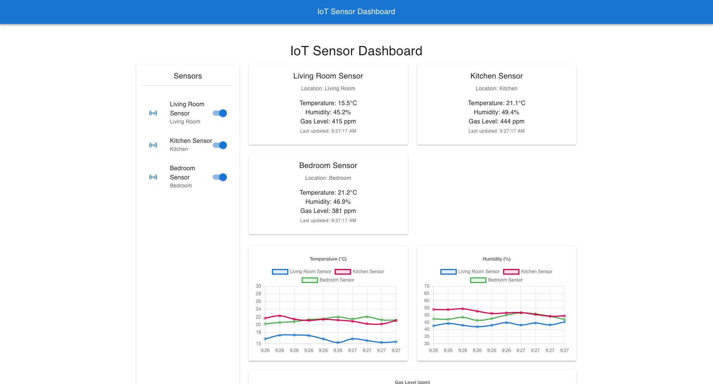

# IoT Sensor Dashboard

A real-time IoT dashboard that visualizes environmental sensor data using modern web technologies. This project demonstrates full-stack development skills by combining IoT devices, cloud services, and a responsive web interface.



## Features

- **Real-time Visualization**: Interactive charts for temperature, humidity, and gas levels
- **Sensor Management**: Enable/disable specific sensors from the dashboard
- **Mock Data Generation**: Built-in simulation for testing without physical sensors
- **MQTT Communication**: Real-time data transmission between sensors and backend
- **Responsive Design**: Works on desktop and mobile devices
- **Modular Architecture**: Separation of concerns between data collection, processing, and visualization

## System Architecture

```
┌─────────────┐     ┌──────────────┐     ┌───────────────┐     ┌─────────────┐
│  IoT Device │     │ MQTT Broker/ │     │   Node.js     │     │  Firebase   │
│  (ESP32 or  │ ──► │  HTTP API    │ ──► │   Backend     │ ──► │  Database   │
│   Python)   │     │ (Mosquitto)  │     │   (Express)   │     │ (Optional)  │
└─────────────┘     └──────────────┘     └───────────────┘     └─────────────┘
                                                                      │
                                                                      │
                                                                      ▼
                                                              ┌─────────────┐
                                                              │    React    │
                                                              │  Dashboard  │
                                                              └─────────────┘
```

## Current Implementation Status

| Component | Status | Description |
|-----------|--------|-------------|
| React Frontend | ✅ | Complete with charts, sensor toggles, and real-time updates |
| Node.js Backend | ✅ | Express server with MQTT connectivity |
| Python Sensor Simulation | ✅ | Virtual sensors generating realistic environmental data |
| MQTT Broker | ✅ | Data transport layer using Mosquitto |
| Firebase Integration | 🔄 | Basic structure defined, ready for implementation |
| Authentication | ⏳ | Planned for future development |

## Getting Started

### Prerequisites

- Node.js (v14 or higher)
- Python 3.8+ (for sensor simulation)
- MQTT Broker (e.g., Mosquitto)
- (Optional) Firebase account
- (Optional) ESP32 device for physical sensors

### Installation

1. Clone the repository:
   ```bash
   git clone https://github.com/yourusername/IoT-Sensor-Dashboard.git
   cd IoT-Sensor-Dashboard
   ```

2. Install backend dependencies:
   ```bash
   cd backend
   npm install
   ```

3. Install frontend dependencies:
   ```bash
   cd ../frontend
   npm install
   ```

4. Set up Python virtual environment for sensor simulation:
   ```bash
   cd ../sensor-simulation
   python3 -m venv venv
   source venv/bin/activate  # On Windows: venv\Scripts\activate
   pip install -r requirements.txt
   ```

5. Set up environment variables:
   ```bash
   # Backend (.env)
   MQTT_BROKER_URL=mqtt://localhost:1883
   PORT=3000

   # Frontend (.env)
   PORT=3001
   REACT_APP_API_URL=http://localhost:3000
   ```

### Running the Application

You'll need four terminal windows to run the complete system:

**Terminal 1 - MQTT Broker**:
```bash
mosquitto
```

**Terminal 2 - Backend**:
```bash
cd backend
npm run dev
```

**Terminal 3 - Frontend**:
```bash
cd frontend
npm start
```

**Terminal 4 - Sensor Simulation**:
```bash
cd sensor-simulation
source venv/bin/activate  # On Windows: venv\Scripts\activate
python simulate_sensors.py
```

The application will be available at:
- Frontend: http://localhost:3001
- Backend API: http://localhost:3000

## Project Structure

```
IoT-Sensor-Dashboard/
├── backend/                 # Node.js Express backend
│   ├── src/
│   │   ├── index.js        # Main Express server
│   │   └── ...
├── frontend/               # React dashboard
│   ├── src/
│   │   ├── components/     # React components 
│   │   │   ├── Dashboard.js       # Main dashboard
│   │   │   └── SensorList.js      # Sensor management
│   │   ├── App.js         # Main app component
│   │   └── ...
├── sensor-simulation/      # Python sensor simulation
│   ├── sensors/            # Sensor implementations
│   │   ├── base_sensor.py         # Base sensor class
│   │   └── environmental_sensor.py # Temperature/humidity sensor
│   ├── simulate_sensors.py # Main simulation script
│   └── ...
├── scripts/                # Utility scripts
└── README.md
```

## Dashboard Features

The dashboard provides:

- **Real-time Charts**: Visualizes temperature, humidity, and gas levels over time
- **Sensor Cards**: Shows the latest readings from each active sensor
- **Sensor Control**: Toggle each sensor on/off to control what data is displayed
- **Responsive Layout**: Adapts to different screen sizes
- **Auto-Updating**: All data updates every 5 seconds automatically

## Implementation Details

### Frontend (React)
- Built with React and Material UI
- Uses Chart.js for responsive, interactive charts
- Real-time data updates using polling and state management
- Responsive design for all screen sizes

### Backend (Node.js)
- Express server for RESTful API endpoints
- MQTT client for subscribing to sensor topics
- JSON parsing and validation
- Structured logging with Winston

### Sensor Simulation (Python)
- Object-oriented design with sensor classes
- MQTT publishing for real-time data transmission
- Realistic data generation with random variations
- Multi-threaded to simulate multiple sensors simultaneously

## Future Enhancements

- [ ] Add user authentication via Firebase Auth
- [ ] Implement historical data storage and retrieval
- [ ] Add alert thresholds for sensor values
- [ ] Create mobile app version
- [ ] Add sensor battery level monitoring
- [ ] Support custom dashboard layouts
- [ ] Implement data export functionality
- [ ] Add geolocation for multiple sensor sites

## License

This project is licensed under the MIT License - see the [LICENSE](LICENSE) file for details.

## Acknowledgments

- [Firebase](https://firebase.google.com/) for real-time database
- [MQTT.js](https://github.com/mqttjs/MQTT.js) for MQTT implementation
- [React](https://reactjs.org/) for the frontend framework
- [Express](https://expressjs.com/) for the backend framework
- [Chart.js](https://www.chartjs.org/) for data visualization
- [Material UI](https://mui.com/) for UI components

## Architecture

The project follows a three-tier architecture:

1. **Data Collection**: Sensors collect and publish environmental data (temperature, humidity, gas levels) via MQTT
2. **Backend**: Node.js Express server subscribes to MQTT topics, processes data, and exposes REST APIs
3. **Frontend**: React-based dashboard with real-time charts and sensor management

## Technologies

- **Backend**: Node.js, Express, MQTT.js, MongoDB, Mongoose
- **Frontend**: React, Material UI, Chart.js
- **Data**: MQTT, MongoDB
- **Security**: JWT Authentication, bcrypt, helmet

## Prerequisites

- Node.js (v14+)
- MongoDB (v4+)
- MQTT Broker (such as Mosquitto)
- Python 3.6+ (for sensor simulation)

## Installation

### 1. Clone the repository

```bash
git clone https://github.com/yourusername/IoT-Sensor-Dashboard.git
cd IoT-Sensor-Dashboard
```

### 2. Set up MongoDB

Make sure MongoDB is installed and running on your system or use a cloud MongoDB service. Update the connection string in the `.env` file.

### 3. Setup environment variables

Create a `.env` file in the backend directory with the following variables:

```
PORT=3000
NODE_ENV=development
MQTT_BROKER_URL=mqtt://localhost:1883
MONGODB_URI=mongodb://localhost:27017/iot_dashboard
JWT_SECRET=your_secret_key_here
JWT_EXPIRE=7d
ALLOWED_ORIGINS=http://localhost:3001
```

### 4. Install backend dependencies

```bash
cd backend
npm install
```

### 5. Install frontend dependencies

```bash
cd frontend
npm install
```

### 6. Install sensor simulation dependencies

```bash
cd sensor-simulation
pip install -r requirements.txt
```

## Usage

### 1. Start the backend server

```bash
cd backend
npm start
```

### 2. Start the frontend development server

```bash
cd frontend
npm start
```

### 3. Run the sensor simulations

```bash
cd sensor-simulation
python run_sensors.py
```

## Authentication

The system uses JWT authentication. To get started:

1. Create a user account through the `/api/auth/register` endpoint:
```json
{
  "username": "admin",
  "email": "admin@example.com",
  "password": "securepassword"
}
```

2. Login to get a JWT token:
```json
{
  "email": "admin@example.com",
  "password": "securepassword"
}
```

3. Include the token in all authenticated requests:
```
Authorization: Bearer <your_token>
```

## Customizing for Your IoT Project

The IoT Sensor Dashboard is designed to be easily adaptable to your specific needs. Here's how to customize it:

### 1. Configuring Your Sensors

#### A. Using the Built-in Sensor Simulator
The included Python sensor simulator creates virtual sensors for temperature, humidity, and gas levels. You can modify:

```bash
cd sensor-simulation/sensors
# Edit environmental_sensor.py to change sensor behavior
```

Key parameters you can modify:
- Temperature range (default: 18-30°C)
- Humidity range (default: 30-80%)
- Gas level range (default: 100-1000 ppm)
- Reading frequency (default: every 5 seconds)

#### B. Connecting Real Sensors
To connect physical sensors:

1. Configure your sensors to publish MQTT messages to topics using this format:
   ```
   sensors/{sensor_id}/data
   ```

2. Ensure your messages follow this JSON structure:
   ```json
   {
     "sensor_id": "unique_sensor_id",
     "name": "Sensor Name",
     "location": "Room Location",
     "type": "Sensor Type",
     "temperature": 23.5,
     "humidity": 45.2,
     "gasLevel": 450,
     "timestamp": "2023-05-08T12:34:56Z"
   }
   ```

3. Additional fields will be stored in the database and can be displayed by modifying the frontend.

### 2. Adding New Sensor Types

To add a new sensor type (e.g., air pressure, CO2):

1. **Update the Reading model**:
   ```javascript
   // backend/src/models/Reading.js
   // Add your new field:
   airPressure: {
     type: Number,
     required: false
   }
   ```

2. **Update the sensor processing logic**:
   ```javascript
   // backend/src/index.js
   // Process and store the new field in the processSensorData function
   ```

3. **Update the frontend to display the new data**:
   ```javascript
   // frontend/src/components/Dashboard.js
   // Add a new chart component for the new sensor type
   ```

### 3. Integrating with Additional Services

The dashboard can be extended to work with various cloud services:

- **AWS IoT Core**: Configure your MQTT broker URL to point to AWS IoT endpoint
- **Azure IoT Hub**: Use the Azure IoT Hub MQTT bridge
- **Google Cloud IoT**: Connect through Google's Cloud IoT MQTT bridge

Update your `.env` file with the appropriate connection details.

### 4. Quick Setup for New Users

For a quick start when cloning this repository:

1. Run the setup script to test connections and create an admin user:
   ```bash
   cd backend
   node scripts/setup.js
   ```

2. Copy the example environment file and customize it:
   ```bash
   cp .env.example .env
   # Edit the .env file with your specific configuration
   ```

3. Use the authentication endpoints to create additional users as needed

## API Endpoints

### Authentication
- `POST /api/auth/register` - Register a new user
- `POST /api/auth/login` - Login and get token
- `GET /api/auth/me` - Get current user (protected)

### Sensors
- `GET /api/sensors` - Get all sensors (protected)
- `GET /api/sensors/:id` - Get a specific sensor (protected)
- `POST /api/sensors` - Create/update a sensor (protected)
- `DELETE /api/sensors/:id` - Delete a sensor (admin only)

### Readings
- `GET /api/readings` - Get all readings (protected)
- `GET /api/readings/:sensorId` - Get readings for a specific sensor (protected)
- `POST /api/readings` - Create a reading (protected)
- `DELETE /api/readings/:sensorId` - Delete readings for a sensor (admin only)